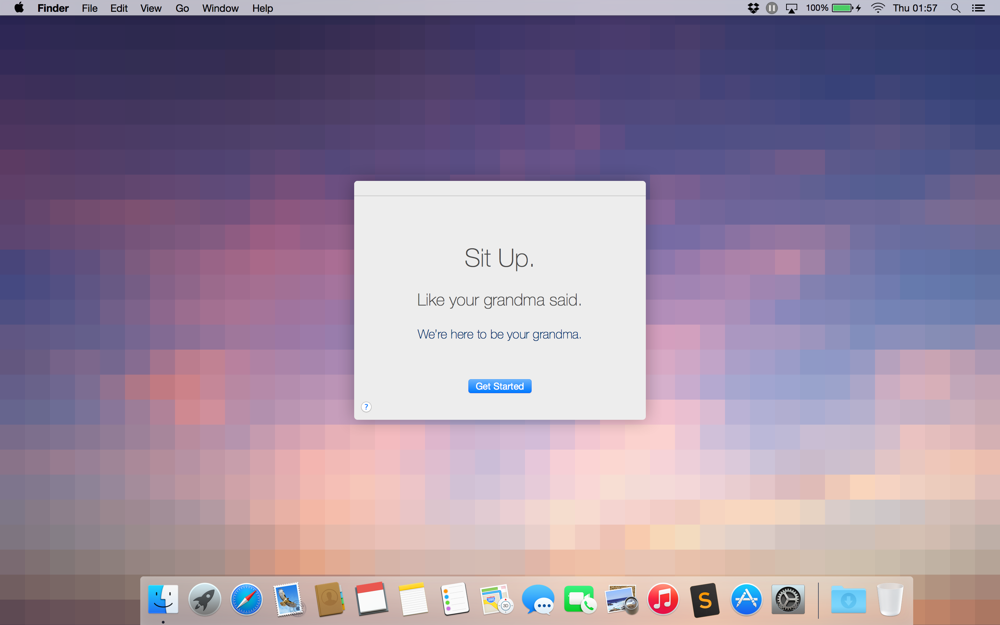

# Sit Up.
## Posture Correction from the Comfort of your Desk

Sit Up is an OS X application concept for utilizing the iSight camera to help encourage and monitor good posture.

The proof-of concept was created in Processing using the OpenCV library. You must have the OpenCV processing library installed in order to run the sketch without errors.

View the presentation here:

